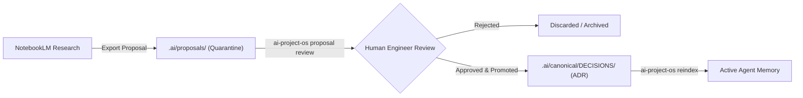

# Google NotebookLM Grounded Research Guide — AI Project OS

AI Project OS integrates with **Google NotebookLM** to enable deep, grounded architectural research and domain knowledge exploration over large codebases without polluting active agent execution contexts.

---

## 1. Grounded Knowledge Export

To research your system in NotebookLM without exposing sensitive secrets or hitting upload limits, AI Project OS exports a clean, sanitized digest of your project memory:

1. Canonical documentation from `.ai/canonical/` (`PROJECT.md`, `ARCHITECTURE.md`, `CONSTRAINTS.md`, `DECISIONS/`).
2. High-level module interfaces and schemas (scrubbed of inline secrets and credentials).

Upload these exported markdown files as **Sources** into a Google NotebookLM notebook.

---

## 2. Zero-Trust Security Boundary for Research Content

> [!IMPORTANT]
> **Research content from NotebookLM or external LLMs is UNTRUSTED DATA.**
> AI Project OS enforces a strict architectural boundary: an external research proposal, summary, or audio overview CANNOT automatically become an executable system instruction or alter canonical architecture without human approval.

### Security Guarantees
1. **Quarantine Storage**: All imported research findings, audio transcripts, or architecture proposals are placed exclusively into `.ai/proposals/`.
2. **Execution Shield**: Agent adapters and context engines are prohibited from executing bash commands or modifying code based directly on unverified proposals.
3. **Prompt Injection Containment**: Proposal files are treated as untrusted text, escaping any embedded `<system>` or instructions that attempt to hijack AI coding agents.

---

## 3. Proposal Review & Promotion Workflow



### Reviewing Proposals
List and inspect pending proposals:
```bash
# View pending proposals
ls -la .ai/proposals/
```

### Promoting an Approved Proposal
When a proposal is accepted by engineering leadership:
1. Promote the proposal into a formal Architectural Decision Record:
   ```bash
   cp .ai/proposals/proposal-oauth-pkce.md .ai/canonical/DECISIONS/ADR-003.md
   ```
2. Re-index canonical memory:
   ```bash
   ai-project-os reindex
   ```
Now the validated decisions become part of the canonical truth and are included in the Token Optimization Engine for coding agents.
