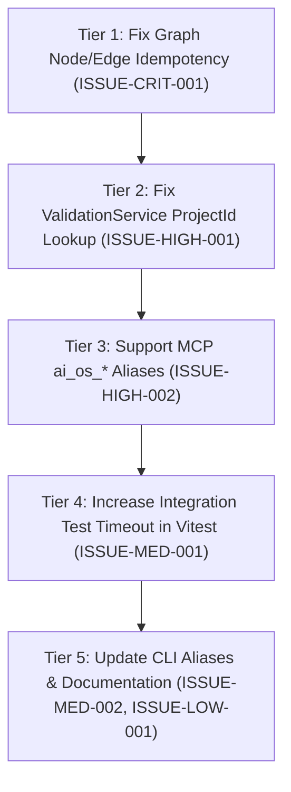

# PRIORITY FIXES PLAN — AI PROJECT OS

**Based on**: Full System Reality Audit (September 20, 2026)  
**Constraint Enforced**: **NO NEW FEATURES. FIXES ORDERED STRICTLY BY TECHNICAL DEPENDENCIES.**

---

## 1. Technical Dependency Graph of Fixes

The fixes are ordered strictly according to their underlying runtime dependencies:
1. **Tier 1 (Data & Storage Integrity)**: Graph idempotency and node deduplication must be fixed first, because the Context Engine and Handoff Engine depend directly on the knowledge graph.
2. **Tier 2 (Service Layer Stability)**: ValidationService foreign key resolution must be resolved next, so that task completion and automated gates do not crash when `projectId` is omitted.
3. **Tier 3 (Agent Interface Alignment)**: MCP tool naming and routing must be aligned between `server.ts` and agent client prompts (`MCP.md` / `AGENTS.md`) so that agents do not fail tool dispatch.
4. **Tier 4 (Test Harness Reliability)**: Test timeout configuration must be extended so that integration tests reliably pass in parallel CI environments.
5. **Tier 5 (User & Documentation Parity)**: CLI command routing and documentation inconsistencies should be updated last once all runtime contracts are verified.



---

## 2. Prioritized Fix Queue

### Fix 1: Graph Node & Edge Idempotency During Symbol Re-indexing
- **Issue Reference**: `ISSUE-CRIT-001`
- **Component**: `src/database/repositories/graph.repository.ts`, `src/code-intelligence/symbol-indexer.ts`
- **Why First**:
  Every incremental change or re-scan currently pollutes SQLite with duplicate symbol nodes and duplicate relation edges. Because the Context Engine traverses this graph to retrieve related symbols and files for agents, graph duplication directly inflates context candidate lists and degrades token optimization.
- **Root Cause**:
  `SymbolIndexer.deleteSymbolsForFile(fileId)` purges the `symbols` table, but does not delete the corresponding nodes in `graph_nodes`. Furthermore, `GraphRepository.addNode()` computes entity IDs for symbols using `sym.id` (a new random UUID on every re-index) instead of a deterministic identifier like `${filePath}:${symbolName}`.
- **Recommended Implementation Steps**:
  1. Add a method in `GraphRepository` to delete symbol nodes by file path:
     ```sql
     DELETE FROM graph_nodes WHERE project_id = ? AND path = ? AND entity_type = 'symbol';
     ```
  2. Ensure `GraphRepository.deleteFileGraph(projectId, filePath)` also clears all outgoing and incoming edges connected to those symbol nodes.
  3. Change the deterministic entity key for symbol graph nodes to `${filePath}:${symbolName}` so that `findNodeByEntity` can find and update the existing node in-place.

---

### Fix 2: Automatic Task-to-Project ID Resolution in ValidationService
- **Issue Reference**: `ISSUE-HIGH-001`
- **Component**: `src/validation/validation-service.ts`
- **Why Second**:
  Depends on SQLite foreign keys. When agents or orchestrators run validation during task transitions, omitting `projectId` causes an unhandled SQLite `FOREIGN KEY constraint failed` error on `validation_runs`.
- **Root Cause**:
  All methods (`runTests`, `runLint`, `runTypecheck`, `runBuild`, `runContractChecks`, `validateAll`) contain:
  `const projectId = options?.projectId || 'default';`
  If `options.projectId` is undefined and no project record with id `'default'` exists, the query fails foreign key validation against the `projects` table.
- **Recommended Implementation Steps**:
  1. In `ValidationService`, resolve the project ID dynamically:
     ```typescript
     let projectId = options?.projectId;
     if (!projectId && options?.taskId) {
       const task = this.taskRepo.findById(options.taskId);
       if (task) projectId = task.projectId;
     }
     if (!projectId) {
       // Lookup active project from database or fallback safely
       const allProjects = this.projectRepo?.list() ?? [];
       projectId = allProjects[0]?.id ?? 'default';
     }
     ```
  2. Verify that `options.taskId` automatically resolves the associated project and records the validation run successfully.

---

### Fix 3: Standardize MCP Tool Names & Support `ai_os_*` Aliases
- **Issue Reference**: `ISSUE-HIGH-002`
- **Component**: `src/mcp/server.ts`
- **Why Third**:
  Depends on service stability. External agents configured via `MCP.md` or following `AGENTS.md` instructions will invoke `ai_os_get_task_context` and fail with "tool not found" errors.
- **Root Cause**:
  `src/mcp/server.ts` only registers short names (`get_task`, `get_context`, `save_handoff`), whereas the specification and agent system prompt rules document prefixed names (`ai_os_get_active_task`, `ai_os_get_task_context`, `ai_os_submit_handoff`, `ai_os_query_graph`).
- **Recommended Implementation Steps**:
  1. In `src/mcp/server.ts`, register tool aliases or accept tool calls with or without the `ai_os_` prefix in `dispatchTool`:
     ```typescript
     const normalizedName = name.startsWith('ai_os_') ? name.replace('ai_os_', '') : name;
     ```
  2. Map legacy tool aliases:
     - `ai_os_get_active_task` → `get_task`
     - `ai_os_get_task_context` → `get_context`
     - `ai_os_submit_handoff` → `save_handoff`
     - `ai_os_query_graph` → `search_graph`
     - `ai_os_validate_task` → `request_validation`
     - `ai_os_search_memory` → `search_memory`

---

### Fix 4: Increase Vitest Timeout for Multi-Agent Orchestrator Integration Tests
- **Issue Reference**: `ISSUE-MED-001`
- **Component**: `tests/unit/project-orchestrator.test.ts`, `vitest.config.ts`
- **Why Fourth**:
  Ensures the test suite passes 100% reliably in CI and parallel local execution runs.
- **Root Cause**:
  Default Vitest test timeout is 5,000ms. The comprehensive end-to-end scenario involves filesystem initialization, Git commit generation, AST indexing, handoff serialization, and resume validation, which takes ~5,400ms when executed alongside 45 other test suites.
- **Recommended Implementation Steps**:
  1. In `tests/unit/project-orchestrator.test.ts`, add a 15,000ms timeout argument to the end-to-end collaboration scenario:
     ```typescript
     it('executes full lifecycle: Agent A starts -> modifies -> handoff -> Agent B resumes on SAME working tree -> modifies -> completes', async () => {
       // test logic
     }, 15000);
     ```
  2. Or update `vitest.config.ts` with `testTimeout: 10000`.

---

### Fix 5: Align CLI Commands & User Guide Documentation
- **Issue Reference**: `ISSUE-MED-002`, `ISSUE-LOW-001`
- **Component**: `USER_GUIDE.md`, `MCP.md`, `src/cli.ts`
- **Why Fifth**:
  User-facing alignment after underlying functionality is verified.
- **Root Cause**:
  `USER_GUIDE.md` references non-existent commands (`ai-project-os init`, `ai-project-os context`, `ai-project-os task create`), and `MCP.md` references an outdated node output path (`dist/mcp/server.js`).
- **Recommended Implementation Steps**:
  1. In `src/cli.ts`, add convenience aliases:
     - `init`: creates `.ai/` directory structure and runs initial database migrations.
     - `context <taskId>`: shorthand that forwards to `contextService.getContext(taskId)`.
  2. Update `USER_GUIDE.md` to reflect the actual CLI subcommands (`session handoff`, `session resume`, `tasks`, `guard`).
  3. Correct the Claude Desktop path in `MCP.md` to point to `dist/src/mcp/server.js`.
