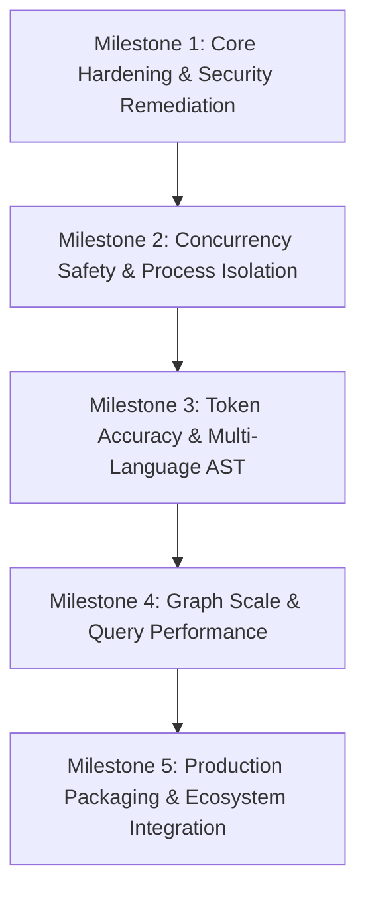

# TECHNICAL ROADMAP — AI PROJECT OS (CofAIOS)

> **Ordering Principle**: Strict technical dependency hierarchy (Prerequisites $\rightarrow$ Core Security $\rightarrow$ Concurrency $\rightarrow$ Performance $\rightarrow$ UI/Distribution).  
> **Anti-Hype Policy**: No features are scheduled based on aesthetic appeal; each milestone unblocks the architectural prerequisites of subsequent phases.

---



---

## Milestone 1: Core Hardening & Security Remediation (Immediate Prerequisites)

> **Technical Rationale**: System APIs and database definitions must be secure and contractually consistent before extending runtime capabilities or concurrency.

### Step 1.1: Localhost API Server Security & CSRF Shield
- **Dependency**: None (Direct prerequisite for Desktop UI and external tooling).
- **Deliverables**:
  - Restrict CORS in `src/ui/api-server.ts`: Remove `Access-Control-Allow-Origin: *` and enforce strict local origin check (`http://127.0.0.1:<port>`, `http://localhost:<port>`).
  - Introduce an ephemeral local authentication token: generate a cryptographic session secret in `.ai/state/ui-token` on server boot; enforce `Authorization: Bearer <token>` on all `/api/actions/*` mutation endpoints.
  - Implement DNS rebinding defense by validating the HTTP `Host` header against `localhost` / `127.0.0.1`.

### Step 1.2: Schema Synchronization & DDL Rectification
- **Dependency**: None (Direct prerequisite for clean installations and database migrations).
- **Deliverables**:
  - Synchronize `src/database/schema.sql` with migrations 001–010.
  - Fix status check constraints on `tasks` table from uppercase (`'BACKLOG'`, `'READY'`) to canonical lowercase (`'planned'`, `'in_progress'`, `'blocked'`, `'handoff'`, `'resumed'`, `'testing'`, `'done'`).
  - Add missing table DDLs to `schema.sql` (`execution_sessions`, `obsidian_sync_ledger`, `research_proposals`).

### Step 1.3: MCP Tool Naming Normalization & Dual-Dispatch
- **Dependency**: None (Direct prerequisite for agent interoperability).
- **Deliverables**:
  - Update `src/mcp/server.ts` to support both prefixed (`ai_os_*`) and canonical short names (`get_task`, `get_context`, `save_handoff`).
  - Align `MCP.md`, `ARCHITECTURE.md`, and `server.ts` so documentation and JSON-RPC implementations match 100%.

---

## Milestone 2: Concurrency Safety & Process Isolation

> **Dependency**: Requires Milestone 1 (Database schema must be synchronized; security boundary hardened).  
> **Technical Rationale**: Parallel agent operations and resilient resumption cannot function reliably without process-level file locks and database optimistic concurrency control.

### Step 2.1: Workspace Session Lock & Mutual Exclusion
- **Dependency**: Milestone 1.
- **Deliverables**:
  - Implement `.ai/state/session.lock` using advisory file locking (`fs.openSync` with `O_EXCL` / `flock`).
  - Record holding PID, agent identity, and lease timestamp with periodic heartbeat renewal.
  - Fail fast with `ActiveSessionConflictError` if a secondary agent attempts to mutate the active working tree without an explicit `--force` or handoff completion.

### Step 2.2: Optimistic Concurrency Control in Task Repository
- **Dependency**: Milestone 1 (Requires verified `tasks.version` column in schema).
- **Deliverables**:
  - Update `TaskRepository.transitionStatus` and `TaskRepository.update` to execute:
    ```sql
    UPDATE tasks 
    SET status = ?, version = version + 1, updated_at = ? 
    WHERE id = ? AND version = ?;
    ```
  - Throw `OptimisticConcurrencyError` if 0 rows are affected, alerting the agent to refresh its task snapshot.

### Step 2.3: Multi-Agent Git Worktree Coordination Pattern
- **Dependency**: Step 2.1 & Step 2.2.
- **Deliverables**:
  - Create `WorktreeManager` in `src/sessions/` supporting parallel agent tasks across isolated Git worktrees (`.git/worktrees/agent-<session_id>`).
  - Enable concurrent agents to work on separate tasks within the same repository without file collision.

---

## Milestone 3: Token Accuracy & Multi-Language AST

> **Dependency**: Requires Milestone 2 (State mutations must be atomic and protected against concurrency race conditions).  
> **Technical Rationale**: Accurate token calculation and code outline extraction are fundamental to staying within token budgets across polyglot repositories.

### Step 3.1: Deterministic BPE Tokenizer Integration
- **Dependency**: None (Can run parallel to Milestone 2, but required before Step 3.3).
- **Deliverables**:
  - Integrate a fast local BPE tokenizer (e.g. `@dqbd/tiktoken` using `cl100k_base` model) with graceful heuristic fallback.
  - Calibrate `ContextEstimator` to eliminate underestimation on Vietnamese, Asian languages, and dense code symbols.

### Step 3.2: AST Code Slicing (Semantic Method Extraction)
- **Dependency**: Milestone 1.
- **Deliverables**:
  - Enhance `ASTAnalyzer` and `ContextCompressor`: Instead of full file outline vs raw file, implement target-symbol slicing (extracting caller signature + body + immediate imports).
  - Reduce token expenditure on large modified files (>1,000 lines) by an additional 30% to 50%.

### Step 3.3: Polyglot AST Engine (Tree-sitter WASM)
- **Dependency**: Step 3.1 & Step 3.2.
- **Deliverables**:
  - Introduce `web-tree-sitter` WASM grammar modules for Python, Go, Rust, and Java.
  - Implement symbol extraction, imports, exports, and call hierarchies for non-JS/TS repositories, fulfilling the universal code intelligence architecture specification.

---

## Milestone 4: Graph Scale & Query Performance

> **Dependency**: Requires Milestone 3 (AST symbols and language models must generate clean graph nodes and edges).  
> **Technical Rationale**: Large monorepos with >100,000 nodes require native database acceleration for graph traversals and re-indexing.

### Step 4.1: SQLite Recursive CTE Traversal
- **Dependency**: Milestone 1 (Verified Graph schema).
- **Deliverables**:
  - Refactor `GraphRepository.getNeighbors` and `findPath` to utilize SQLite `WITH RECURSIVE` queries rather than loop-based multi-round trips.
  - Reduce multi-hop graph resolution latency from ~40ms to <3ms on graphs with >50,000 edges.

### Step 4.2: Parallel Worker Thread Indexing Pool
- **Dependency**: Step 3.3 (Polyglot AST parsers).
- **Deliverables**:
  - Refactor `CodeIndexer.indexProject` to distribute file scanning across a Node.js `worker_threads` pool.
  - Benchmark targets: Index 10,000 files in <3.5 seconds on multi-core workstations.

---

## Milestone 5: Production Packaging & Ecosystem Integration

> **Dependency**: Requires Milestones 1 through 4 (All core invariants, security gates, concurrency protections, and token estimators must be mature and stable).  
> **Technical Rationale**: Client UI wrappers and distribution binaries should only be finalized once the underlying engine guarantees zero data loss and secure local execution.

### Step 5.1: Tauri Desktop App Finalization & Native IPC
- **Dependency**: Milestone 1 (Hardened API server) & Milestone 2 (Session locking).
- **Deliverables**:
  - Wire `src-tauri` with native Rust IPC commands directly invoking `ControlCenterService`, eliminating local HTTP port exposure when running as a standalone desktop executable.
  - Produce signed macOS (`.dmg`), Linux (`.AppImage`/`.deb`), and Windows (`.msi`) binaries.

### Step 5.2: Official IDE & Agent Plugins
- **Dependency**: Milestone 1 (Standardized MCP server) & Milestone 2 (Session locking).
- **Deliverables**:
  - Publish official Cursor MCP configuration profile and Claude Desktop extension bundle.
  - Build VS Code extension providing interactive task Kanban, graph visualization, and real-time handoff inspector directly inside the editor sidebar.
