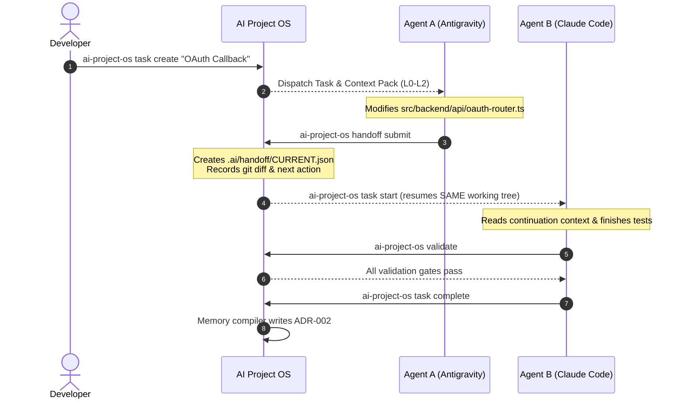

# User Guide — AI Project OS

Welcome to **AI Project OS**, the operating system for collaborative AI coding agents and human engineers. This guide explains how to use the CLI, manage tasks, coordinate multi-agent handoffs, and maintain project health.

---

## 1. Core Architecture Philosophy

Traditional AI coding workflows suffer from:
1. **Context Bloat & Token Degradation**: Pasting entire files, repeated chat histories, and irrelevant documentation exhausts model token budgets and degrades reasoning.
2. **Context Loss Across Sessions**: When Agent A ends or hits token limits, Agent B starts from scratch without knowing what uncommitted changes were made, which tests passed, or what blockers occurred.
3. **Prompt Injection through Untrusted Repo Files**: Attackers can place malicious instructions inside repository markdown or documentation files that hijack agent tool execution.

AI Project OS solves this by providing:
- **Zero-External-Dependency Local Core**: Built on Node.js 22 and SQLite WAL.
- **Hierarchical Token Optimization Engine (L0–L4)**: Deterministically constructs the smallest possible high-relevance context pack (averaging 99%+ token reduction).
- **Zero-Context-Loss Handoffs**: Standardized handoff envelopes (`CURRENT.json`) capturing task objective, Git working tree diffs, touched files, and next actions.
- **Strict Security Boundaries**: Distinction between trusted system instructions and untrusted repository/research data.
- **Automated Self-Healing Doctor**: Built-in diagnostics and repair tools.

---

## 2. CLI Command Reference

### System Administration & Health

| Command | Description | Example |
|---|---|---|
| `ai-project-os init` | Initialize `.ai/` state, databases, and canonical memory | `ai-project-os init` |
| `ai-project-os doctor` | Comprehensive health check and integrity diagnostics | `ai-project-os doctor` |
| `ai-project-os repair` | Automatic self-repair of broken directories, orphaned edges, and stale sessions | `ai-project-os repair` |
| `ai-project-os reindex` | Re-scans project source code and updates symbol index | `ai-project-os reindex` |
| `ai-project-os rebuild-graph` | Rebuilds AST dependency and entity relationship graph | `ai-project-os rebuild-graph` |
| `ai-project-os validate` | Executes validation gates (database, memory, graph, tests) | `ai-project-os validate` |
| `ai-project-os backup [dir]` | Creates atomic zero-lock snapshot of database and memory | `ai-project-os backup ./my-backups` |
| `ai-project-os restore <dir>` | Restores project state from a validated backup archive | `ai-project-os restore ./my-backups/backup-123` |

### Task Management

| Command | Description | Example |
|---|---|---|
| `ai-project-os task create` | Create a new task with title, description, and type | `ai-project-os task create --title "OAuth Login" --type feature` |
| `ai-project-os task list` | List tasks filtered by status | `ai-project-os task list --status in_progress` |
| `ai-project-os task start <id>` | Start task session for an agent | `ai-project-os task start <id> --agent "antigravity"` |
| `ai-project-os task complete <id>` | Complete task after validation gates pass | `ai-project-os task complete <id>` |

### Context & Handoff Management

| Command | Description | Example |
|---|---|---|
| `ai-project-os context <taskId>` | Generate a token-budgeted context package (L0–L4) | `ai-project-os context <taskId> --budget 8000` |
| `ai-project-os session start <taskId>` | Start an explicit agent session | `ai-project-os session start <taskId> --provider antigravity` |
| `ai-project-os session status` | Check status and continuity of current active session | `ai-project-os session status` |
| `ai-project-os handoff submit` | Submit active session handoff manifest | `ai-project-os handoff submit --summary "Step 1 done" --next "Step 2"` |
| `ai-project-os handoff resume` | Inspect and resume from pending handoff | `ai-project-os handoff resume` |
| `ai-project-os guard` | Evaluate anti-bloat and architecture boundary rules | `ai-project-os guard --strict` |

### Interactive Control Center

Launch the local web dashboard and REST API server:

```bash
ai-project-os ui --port 4300
```
Open `http://localhost:4300` in your browser to view:
- Live Task Board & Checkpoints
- Code Dependency Graph Visualizer
- Multi-Agent Session History
- Real-time Git Working Tree Diffs & Validation Gates

---

## 3. Multi-Agent Workflow Tutorial

Here is the recommended workflow when two agents (e.g., Antigravity and Claude Code) collaborate on a feature:



### Step 1: Create the Task
```bash
ai-project-os task create \
  --title "Implement OAuth callback handling" \
  --type feature \
  --description "Add Google & GitHub OAuth callback router with token exchange"
```

### Step 2: Agent A Starts & Obtains Context
Agent A requests context via CLI or MCP tool:
```bash
ai-project-os context <TASK_ID> --budget 8000
```
The Context Engine deterministically retrieves:
- **L0 (Task Objective)**: Goal, criteria, constraints.
- **L1 (Session Continuity)**: Active blockers and current step.
- **L2 (Code Locality)**: Relevant files (`oauth-router.ts`, `db-client.ts`).
- **L3 (Architecture Constraints)**: Security rules, encryption requirements.

### Step 3: Agent A Submits Handoff
Before exiting or when switching tasks, Agent A runs:
```bash
ai-project-os handoff submit \
  --task-id <TASK_ID> \
  --summary "Created OAuth callback endpoints; pending JWT signing logic" \
  --next-steps "Complete token validation and write test cases"
```

### Step 4: Agent B Resumes on the Same Working Tree
Agent B resumes immediately with full knowledge of Agent A's uncommitted diffs:
```bash
ai-project-os context <TASK_ID>
```
Agent B receives the exact continuation context, completes the JWT signing logic, runs test validation, and marks the task complete:
```bash
ai-project-os validate
ai-project-os task complete <TASK_ID>
```

---

## 4. Working with Canonical Memory

The `.ai/canonical/` directory is the single source of truth for high-level architectural knowledge:
- `PROJECT.md`: High-level business mission, core domain terminology, and system capabilities.
- `ARCHITECTURE.md`: Layer definitions, boundary enforcement rules, and technology stack.
- `CONSTRAINTS.md`: Security mandates, latency requirements, and coding conventions.
- `DECISIONS/*.md`: Architectural Decision Records (ADRs) generated or updated during project execution.

### Creating an Architecture Decision Record (ADR)
Add a markdown file into `.ai/canonical/DECISIONS/ADR-001.md`:
```markdown
# ADR-001: SQLite WAL Persistence for Local-First OS

## Status
Accepted

## Context
AI Project OS requires high-performance relational queries, full-text search, and atomic backups without requiring external daemon processes.

## Decision
We adopt Node.js 22 `node:sqlite` in WAL mode with PRAGMA foreign_keys = ON.

## Consequences
- Zero external daemon requirements.
- Point-in-time backups via `VACUUM INTO`.
```

After modifying canonical memory, refresh the full-text search index and memory compiler:
```bash
ai-project-os reindex
```
